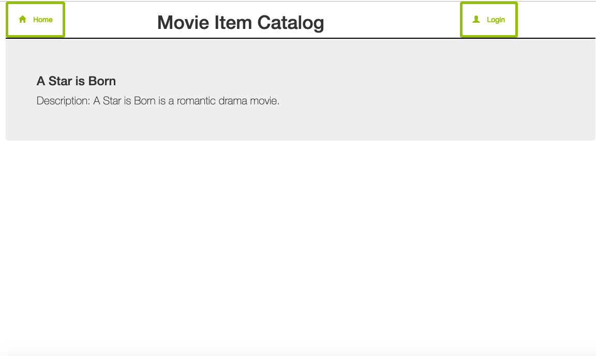

# Movie Item Catalog Application

* Author: May Wong
* Email: msg2may@gmail.com

This application displays the list of movies in the catalog based on its category.  
It provides the user's authentication with Facebook OAuth2 system.
Login users can add new items, edit and delete items that they have created.


## Prerequisites: To run the program

Install the following applications in order to run the program.

  * [VirtualBox](https://www.virtualbox.org)
  * [Vagrant](https://www.vagrantup.com)
  * [Git](https://git-scm.com/)
  * Clone the fullstack-­nanodegree-­vm repository. [VM Configuration here](https://github.com/udacity/fullstack-nanodegree-vm)
  * python2 is used to execute the program.

## Development Environment

  * The development environment is configured and set up as described in course lecture using Virtual Machine and vagrant.


## Database

  * This program uses SQLite database.
  * Database Design:
    - The program has two tables: User and Movie
    - User table is for user login and logout information
    - Movie table is for the item catalog

## Program Design

  * This program uses ORM SQLAlchemy with SQLite database.  
  * The program provides users with facebook OAuth2 authentication to perform CRUD operation


## Directions

  * cd to your vagrant directory. For example: fullstack-­nanodegree-­vm/vagrant
  * Run:
   ```
   vagrant up
   ```
  * Run:
   ```
   vagrant ssh
   ```
  * cd to:
   ```
   cd /vagrant
   ```
  * copy all my files and directories to /catalog directory
  * To setup the database:
  ```
  python database_setup.py
  ```
  * To populate and add data to database:
  ```
  python populateCatalog.py
  ```
  * Run the application:
  ```
  python application.py
  ```
  * In the web browser, type "http://localhost:8000" to see the homepage
  * From that homepage user can browse and see the movie item catalog
  * Login with facebook authentication to post, edit and delete own items.

## Usage: Screenshot
  * Homepage is http://localhost:8000 or http://localhost:8000/catalog
  > [](Image)
  > [](Image)

  * Others screenshot as follow:
  > [](Image)
  > [](Image)
  > [](Image)
  > [](Image)
  > [](Image)
  > [](Image)
  > [](Image)
  > [](Image)
  > [](Image)
  > [](Image)
  > [](Image)

  * JSON end point for catalog: http://localhost:8000/catalog.json
  > [](Image)

  * JSON end point for category: http://localhost:8000/catalog/Romance.json/
  > [](Image)

  * JSON end point for item: http://localhost:8000/catalog/Romance/4.json/
  > [](Image)


## Acknowledgments
  * Virtual Machine Configuration is provided by Udacity.
